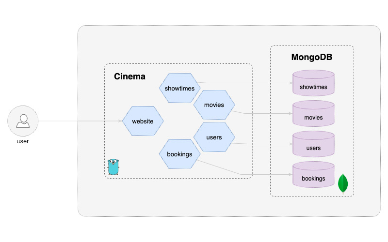

# Cinema - Example of Microservices in Go with Docker, Kubernetes and MongoDB

## Overview

Cinema is an example project which demonstrates the use of microservices for a fictional movie theater.
The Cinema backend is powered by 4 microservices, all of which happen to be written in Go, using MongoDB for manage the database and Docker to isolate and deploy the ecosystem.

 * Movie Service: Provides information like movie ratings, title, etc.
 * Show Times Service: Provides show times information.
 * Booking Service: Provides booking information.
 * Users Service: Provides movie suggestions for users by communicating with other services.

## Index

* [Deployment](#deployment)
* [How To Use Cinema Services](#how-to-use-cinema-services)
* [Related Posts](related-posts)
* [The big picture](#screenshots)

## Deployment

* [local machine (docker compose)](./docs/localhost.md)

## How To Use Cinema Services

* [endpoints](./docs/endpoints.md)

## Related Posts

* [Traefik 2 - Advanced configuration with Docker Compose](https://mmorejon.io/en/blog/traefik-2-advanced-configuration-docker-compose/)

## Screenshots

### Architecture

### Homepage

### Users List

